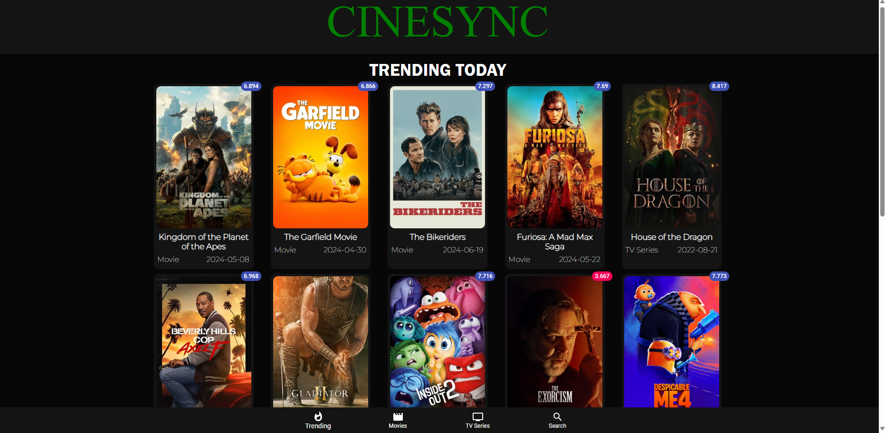

# CineSync

## Description
CineSync is a films discovery application that allows users to search for trending Movies and TV Series, view ratings, watch trailers, and browse cast galleries. It aims to make it easy for users to find and explore Films.

## Features
With the app, you can:

* See a list of trending Movies and TV Series
* Search for Movies and TV Series
* Get desired Movies and TV Series based on specified genres
* Get ratings of Movies and TV Series
* Watch Film trailers
* View a gallery of cast members

**Deployed Site:** [CineSync](https://cine-sync-blush.vercel.app/)

## Dependencies
* [React](https://reactjs.org/)                                         | ^17.0.1
* [material-ui/core](https://mui.com)                                   | ^4.11.2
* [material-ui/icons](https://mui.com)
* [material-ui/lab](https://mui.com)
* [React-dom](https://reactjs.org/)                                     | ^17.0.1
* [axios](https://axios-http.com)                                       | ^0.21.1
* [react-alice-carousel](https://npmjs.com)                             | ^2.2.1
* [react-router-dom](https://npmjs.com)                                 | ^5.2.0

## Licensing
This project is licensed under the MIT License. See the [LICENSE](LICENSE) file for details.
